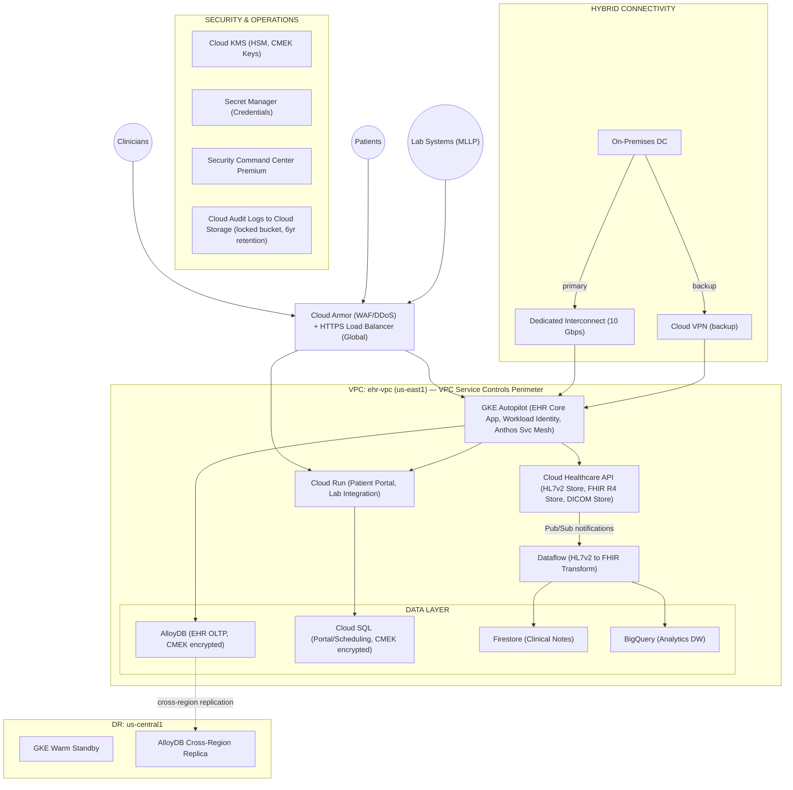

# Case Study 1: EHR Healthcare

> **Exam Version:** Google Professional Cloud Architect (PCA) — 2025 (Updated October 2025)
> **Domain:** Healthcare SaaS | **Compliance:** HIPAA, HL7, FHIR

---

## 1. Company Overview

**EHR Healthcare** is a software-as-a-service company providing Electronic Health Record (EHR) systems to hospitals, physician groups, and health networks across the United States. Their platform enables clinicians to access, document, and share patient medical records, lab results, prescriptions, and diagnostic imaging.

**Current state:**
- Serves hundreds of healthcare organizations ranging from small practices to large hospital networks
- Platform is critical infrastructure — downtime directly impacts patient care
- Has grown through acquisitions, resulting in heterogeneous on-premises infrastructure
- Engineers spend significant time on infrastructure maintenance rather than product features
- Regulatory environment (HIPAA) creates strict requirements for data handling, access, and auditability

**Strategic goals:**
- Migrate to Google Cloud Platform to improve scalability and developer velocity
- Containerize the existing Java monolith as a first step; refactor into microservices over time
- Reduce time-to-market for new features from months to weeks
- Improve disaster recovery posture (current RTO: 4 hours, RPO: 1 hour — target: RTO 1 hour, RPO 15 min)
- Lower total cost of ownership for infrastructure

---

## 2. Technical Requirements

1. **Containerize** the existing monolithic Java EHR application and deploy it on a managed Kubernetes platform.
2. **Migrate databases** from on-premises Oracle and MySQL to GCP with minimal downtime; initially lift-and-shift, then evaluate modernization.
3. **Support HL7 v2 and FHIR R4** message ingestion and processing for interoperability with third-party healthcare systems.
4. **Zero-trust network security** with no publicly exposed sensitive endpoints.
5. **Encrypt all data at rest and in transit**; customer-managed encryption keys (CMEK) required for PHI (Protected Health Information).
6. **Audit logging** for all access to PHI — logs must be immutable and retained for 6 years per HIPAA.
7. **99.9% monthly uptime SLA** during and after migration.
8. **Automated CI/CD pipeline** for code deployment with gated stages and rollback capability.
9. **Multi-region disaster recovery** with automatic failover.
10. **Centralized observability** across all services, with alerting for latency, error rates, and resource utilization.

---

## 3. Business Requirements

1. **Maintain HIPAA compliance** throughout and after migration — any architecture decision must not introduce PHI exposure risk.
2. **Minimize disruption to existing customers** during migration — phased migration with no more than agreed-upon maintenance windows.
3. **Reduce infrastructure operational burden** — engineering team should focus on product features, not managing hardware.
4. **Enable international expansion** in the future — architecture must support data residency requirements for future EU/APAC operations.
5. **Cost predictability** — leadership requires predictable monthly GCP spend with alerts on budget overruns.
6. **Vendor onboarding** — the platform must remain open to integrations with third-party labs, imaging systems, and pharmacies via standard APIs.
7. **Employee productivity** — developers should be able to provision dev/test environments self-service within minutes.

---

## 4. Existing Technical Infrastructure

### On-Premises Data Centers

| Location | Role | Hardware |
|----------|------|----------|
| US-East (primary) | Production | 50+ bare-metal servers, VMware vSphere |
| US-West (secondary) | Disaster recovery | 20 servers, partial mirror of production |

### Applications

| System | Technology | Notes |
|--------|-----------|-------|
| EHR Core Application | Java 11 monolith, Tomcat, SOAP/REST APIs | ~300 microservice candidates identified |
| Patient Portal | Angular SPA + Java REST backend | Separate deployment, moderate traffic |
| Lab Integration Service | Python, HL7 v2 messaging over MLLP | Interfaces with 40+ lab systems |
| Imaging Viewer | HTML5 + DICOM-based Java backend | Large binary data (DICOM files) |
| Reporting Engine | Java + Jasper Reports, nightly batch jobs | Reads from Oracle DW |

### Databases

| Database | Type | Size | Usage |
|----------|------|------|-------|
| Oracle 19c | OLTP | 8 TB | Core clinical data |
| MySQL 8.0 | OLTP | 2 TB | Patient portal, scheduling |
| Oracle Data Warehouse | Analytics | 15 TB | Reporting, BI |
| MongoDB 4.4 | Document store | 500 GB | Unstructured clinical notes |

### Networking & Security

- On-premises Active Directory for identity
- Cisco firewalls, VLANs for network segmentation
- TLS termination at load balancer
- No current PKI infrastructure for mTLS between services

---

## 5. Recommended GCP Architecture

### Core Platform

```
Project Structure (Resource Hierarchy):
Organization: ehrhealthcare.com
  └── Folder: Production
  │     └── Project: ehr-prod-core (VPC, GKE, databases)
  │     └── Project: ehr-prod-data (BigQuery, Dataflow, Cloud Healthcare API)
  │     └── Project: ehr-prod-security (KMS, Secret Manager, SCC)
  └── Folder: Non-Production
        └── Project: ehr-dev
        └── Project: ehr-staging
```

### Compute & Containers

| Component | GCP Service | Rationale |
|-----------|------------|-----------|
| EHR Core App | **GKE Autopilot** (multi-zonal, us-east1) | Managed Kubernetes, reduces ops overhead; Autopilot for node management |
| Patient Portal Backend | **Cloud Run** | Stateless REST API, scales to zero, lower cost |
| Lab Integration Service | **Cloud Run** + **Healthcare API** | Serverless, integrates with Cloud Healthcare HL7v2 stores |
| Imaging Viewer | **GKE** (separate node pool) | Needs more control over resources for DICOM processing |
| Reporting/Batch Jobs | **Cloud Run Jobs** | Replaces nightly Jasper jobs, triggered by Cloud Scheduler |

### Databases

| Original DB | Migration Target | Migration Tool | Long-term Target |
|------------|-----------------|----------------|-----------------|
| Oracle 19c (OLTP) | **AlloyDB for PostgreSQL** | Database Migration Service (DMS) + Schema Conversion Tool (SCT) | AlloyDB — PostgreSQL-compatible, enterprise-grade |
| MySQL 8.0 | **Cloud SQL for MySQL** | Database Migration Service (DMS) | Cloud SQL (stable; consider AlloyDB if query volume grows) |
| Oracle Data Warehouse | **BigQuery** | Dataflow + BigQuery Data Transfer Service | BigQuery — serverless analytics |
| MongoDB | **Firestore** (Native mode) | Custom migration scripts | Firestore — serverless document DB |

### Healthcare Data & Interoperability

- **Cloud Healthcare API** — Native HL7v2, FHIR R4, and DICOM stores
  - HL7v2 store: receives lab messages via MLLP adapter
  - FHIR R4 store: canonical patient data representation
  - DICOM store: imaging data (replaces on-prem PACS integration)
- **Pub/Sub** — event streaming between Healthcare API notifications and downstream systems
- **Dataflow** — HL7v2 to FHIR transformation pipelines

### Networking

```
On-Premises ──────── Dedicated Interconnect (10 Gbps) ──────── VPC (ehr-vpc)
                      (Partner Interconnect as backup)              │
                                                                    ├── Subnet: gke-nodes (private)
                                                                    ├── Subnet: cloud-sql (private, PSA)
                                                                    ├── Subnet: healthcare-api (private)
                                                                    └── Subnet: bastion (restricted)

External Users ──── Cloud Armor ──── HTTPS Load Balancer ──── Cloud Run / GKE Ingress
```

- **Dedicated Interconnect**: primary connectivity from on-prem to GCP during migration
- **Cloud VPN** (backup): failover path if Interconnect is unavailable
- **Private Google Access**: all GCP services accessed via private IPs, no internet exposure
- **VPC Service Controls**: perimeter around PHI-containing projects to prevent data exfiltration
- **Cloud Armor**: WAF and DDoS protection at the load balancer layer

### Security

| Requirement | GCP Service |
|-------------|------------|
| Encryption of PHI at rest (CMEK) | **Cloud KMS** (HSM-backed keys for PHI projects) |
| Secret management | **Secret Manager** |
| PHI access audit logs | **Cloud Audit Logs** (Data Access logs enabled for all services); export to **Cloud Storage** (locked bucket, 6-year retention) |
| IAM for PHI access | Least-privilege IAM; **VPC Service Controls** perimeter |
| Vulnerability scanning | **Container Analysis** + **Artifact Registry** (automated scanning on push) |
| Threat detection | **Security Command Center Premium** |
| Identity federation | **Cloud Identity** + Workforce Identity Federation (from on-prem AD) |

### Observability

- **Cloud Monitoring**: uptime checks, dashboards, SLO tracking (99.9% availability)
- **Cloud Logging**: centralized logs, log-based metrics, alerts on error rates
- **Cloud Trace**: distributed tracing across GKE and Cloud Run services
- **Cloud Profiler**: continuous CPU/memory profiling of Java services
- **Error Reporting**: automatic exception grouping and alerting

### CI/CD

```
GitHub → Cloud Build (triggered on PR/merge)
  └── Step 1: Unit tests + SAST (Code scanning)
  └── Step 2: Build Docker image → Artifact Registry
  └── Step 3: Container Analysis (vulnerability scan) — gate: CRITICAL CVEs block deploy
  └── Step 4: Deploy to ehr-staging (GKE)
  └── Step 5: Integration tests
  └── Step 6: Manual approval gate (for production)
  └── Step 7: Deploy to ehr-prod (GKE) — Blue/Green via Cloud Deploy
```

---

## 6. Migration Strategy

### Phase 1 — Foundation & Connectivity (Months 1–3)

- Establish GCP organization hierarchy, folder structure, and projects
- Configure Dedicated Interconnect and hybrid DNS
- Set up VPC Service Controls perimeter around PHI projects
- Configure Cloud KMS with CMEK keys; enable audit logging
- Set up Artifact Registry, Cloud Build pipelines
- Migrate patient portal MySQL → Cloud SQL for MySQL (low risk, first database migration)

### Phase 2 — Containerize and Lift EHR Core (Months 3–6)

- Containerize Java EHR monolith into Docker; deploy to GKE Autopilot (no code changes)
- Run in parallel with on-prem ("strangler fig" traffic shifting via load balancer)
- Migrate Oracle OLTP → AlloyDB using DMS (continuous replication, near-zero downtime cutover)
- Deploy Cloud Healthcare API FHIR and HL7v2 stores; route lab integration via new pipeline
- Validate HIPAA compliance posture with internal audit

### Phase 3 — Data & Analytics Migration (Months 6–9)

- Migrate Oracle Data Warehouse → BigQuery (Dataflow pipelines for historical data)
- Migrate MongoDB → Firestore
- Rebuild nightly batch reporting as Cloud Run Jobs + Looker Studio dashboards
- Deploy DICOM store in Cloud Healthcare API; migrate imaging archive from on-prem PACS

### Phase 4 — Modernization & Decommission (Months 9–18)

- Decompose EHR monolith into microservices incrementally (strangler fig pattern)
- Implement Cloud Run for stateless microservices; retain GKE for stateful/complex services
- Decommission on-prem primary data center
- Convert secondary site to minimal hybrid connectivity hub (not full DR)
- Enable multi-region Cloud Spanner evaluation for global write requirements (future)

### Cutover Strategy

- **Database cutover**: use DMS continuous replication; cutover during low-traffic maintenance window (Sunday 2–4 AM); dual-write period of 48 hours for validation
- **Application cutover**: weighted traffic splitting (10% → 25% → 50% → 100%) using Cloud Load Balancing
- **Rollback plan**: on-prem kept warm for 30 days post-cutover; DMS replication can be reversed if needed

---

## 7. Security & Compliance Considerations

### HIPAA Technical Safeguards

| Safeguard | Implementation |
|-----------|---------------|
| Access controls | IAM with principle of least privilege; Workforce Identity Federation from AD |
| Audit controls | Cloud Audit Logs (Data Access) enabled on all services touching PHI; immutable export to locked GCS bucket |
| Integrity controls | Object versioning + retention policies on GCS; AlloyDB/Cloud SQL point-in-time recovery |
| Transmission security | TLS 1.2+ enforced everywhere; mTLS between services via Anthos Service Mesh (Istio) |
| Encryption at rest | CMEK with Cloud KMS HSM keys; key rotation policy: 1 year |
| PHI perimeter | VPC Service Controls prevents PHI from leaving the perimeter via unauthorized paths |

### HIPAA Administrative Safeguards

- Google Cloud offers a **HIPAA Business Associate Agreement (BAA)** — must be executed before storing PHI
- **Assured Workloads** for Healthcare: enforces US data residency and FedRAMP-equivalent controls
- Access reviews: Cloud IAM Recommender + Privileged Access Manager (PAM) for just-in-time access

### HL7 & FHIR Compliance

- **Cloud Healthcare API** natively supports:
  - HL7 v2 message store (MLLP adapter for lab systems)
  - FHIR R4 REST API (validated against HL7 FHIR specification)
  - DICOM store (DICOMweb standard)
- **SMART on FHIR** authorization flow supported via Cloud Healthcare API + Identity Platform

### Data Residency

- All PHI stored in **us-east1** (primary) and **us-central1** (DR)
- **Organization Policy constraints/gcp.resourceLocations** restricts resource creation to US regions
- Future EU operations: separate GCP project with EU data residency via Assured Workloads

---

## 8. Key Design Decisions

### Decision 1: GKE Autopilot vs. Standard

**Chose GKE Autopilot** for the EHR Core App.
- *Rationale*: EHR Healthcare wants to reduce operational overhead. Autopilot manages node provisioning, scaling, and OS patching automatically. Security hardening (immutable root FS, Workload Identity) is on by default.
- *Trade-off*: Less node customization flexibility. Acceptable given requirements for operational simplicity.

### Decision 2: AlloyDB vs. Cloud SQL for Oracle Migration

**Chose AlloyDB** for the Oracle OLTP migration.
- *Rationale*: AlloyDB is PostgreSQL-compatible and offers 4x faster analytical queries than standard PostgreSQL. It handles the complex query patterns of a healthcare OLTP system better than Cloud SQL. Fully managed with automatic storage scaling.
- *Trade-off*: Higher cost than Cloud SQL. Justified by workload complexity and the elimination of Oracle licensing costs.

### Decision 3: Cloud Healthcare API vs. DIY FHIR Server

**Chose Cloud Healthcare API**.
- *Rationale*: Native HIPAA-compliant FHIR R4 and HL7v2 stores, built-in audit logging, Pub/Sub notifications for real-time processing. Building and maintaining a custom FHIR server would require significant ongoing engineering effort and compliance risk.
- *Trade-off*: Vendor lock-in to Google's Healthcare API implementation.

### Decision 4: VPC Service Controls Perimeter

**Chose strict VPC-SC perimeter** around PHI projects.
- *Rationale*: Prevents data exfiltration via misconfigured IAM bindings, accidental public bucket exposure, etc. Required by most healthcare HIPAA risk assessments.
- *Trade-off*: Significant operational complexity — all service-to-service calls across the perimeter require access level policies. Must plan perimeter boundaries carefully.

### Decision 5: Dedicated Interconnect vs. VPN During Migration

**Chose Dedicated Interconnect** as primary during migration.
- *Rationale*: Migrating 25+ TB of database data over the public internet is too slow and introduces bandwidth variability. Interconnect provides 10 Gbps dedicated bandwidth and lower latency.
- *Trade-off*: Higher cost than VPN. Acceptable for the migration window; can be right-sized post-migration.

---

## 9. Sample Exam Questions

---

**Question 1**

EHR Healthcare needs to migrate their Oracle 19c OLTP database (8 TB) to GCP with minimal downtime. They require PostgreSQL compatibility and the ability to handle complex analytical queries from the application layer. Which service should they choose?

- A) Cloud SQL for PostgreSQL
- B) Cloud Spanner
- C) AlloyDB for PostgreSQL
- D) Bare Metal Solution

**Answer: C — AlloyDB for PostgreSQL**

*Explanation:* AlloyDB is PostgreSQL-compatible (eliminating Oracle's proprietary SQL concerns with proper schema conversion) and provides 4x better analytical query performance than standard PostgreSQL via its columnar engine. Cloud SQL for PostgreSQL (A) is correct for simpler workloads but lacks the performance characteristics needed for a complex EHR OLTP system. Cloud Spanner (B) is not PostgreSQL-compatible and is designed for globally distributed workloads, which is overkill here. Bare Metal Solution (D) is for Oracle RAC workloads that require Oracle licensing — EHR Healthcare wants to move away from Oracle.

---

**Question 2**

EHR Healthcare must ensure that PHI stored in Google Cloud cannot be exfiltrated through misconfigured IAM bindings or accidentally made public. Which GCP feature primarily addresses this requirement?

- A) Cloud Armor security policies
- B) VPC Service Controls
- C) Cloud KMS with CMEK
- D) Organization Policy constraints

**Answer: B — VPC Service Controls**

*Explanation:* VPC Service Controls creates a security perimeter around GCP resources, preventing data exfiltration regardless of IAM configuration. Even if a service account is granted public access or a bucket is misconfigured, data cannot leave the perimeter. Cloud Armor (A) is a WAF/DDoS tool at the HTTP layer, not a data exfiltration control. CMEK (C) encrypts data but doesn't prevent it from being exfiltrated in encrypted form. Organization Policies (D) restrict resource configuration but don't enforce data boundaries in the same way.

---

**Question 3**

EHR Healthcare's Lab Integration Service currently sends HL7 v2 messages over MLLP to 40 lab systems. After migrating to GCP, they need to receive these messages, transform them to FHIR R4 resources, and trigger downstream workflows. What is the recommended architecture?

- A) Cloud Pub/Sub → Cloud Functions → Firestore
- B) Cloud Healthcare API (HL7v2 store) → Pub/Sub notification → Dataflow pipeline → Cloud Healthcare API (FHIR store)
- C) Cloud Run service (custom MLLP listener) → Cloud SQL
- D) Cloud IoT Core → Pub/Sub → BigQuery

**Answer: B**

*Explanation:* Cloud Healthcare API natively supports HL7 v2 message stores and can be configured with Pub/Sub notifications when new messages are ingested. A Dataflow pipeline (using the Google-provided HL7v2 to FHIR template) transforms the messages and writes validated FHIR resources to a Cloud Healthcare API FHIR R4 store. This is the canonical GCP architecture for HL7-to-FHIR transformation. Option A loses the HL7v2 structure and compliance tooling. Option C requires building and maintaining a custom MLLP server. Option D is for IoT device data, not healthcare messaging.

---

**Question 4**

During the migration, EHR Healthcare needs to maintain 99.9% uptime for the production EHR Core Application. They are considering a cutover strategy for the application layer. Which approach best minimizes risk?

- A) Big-bang cutover during a scheduled 4-hour maintenance window
- B) Weighted traffic splitting using Cloud Load Balancing, gradually shifting from on-prem to GKE
- C) DNS-based cutover by changing A records to point to the new GKE service
- D) Deploy the new GKE environment and immediately decommission on-premises

**Answer: B — Weighted traffic splitting**

*Explanation:* Weighted traffic splitting via Cloud Load Balancing allows a gradual shift (e.g., 5% → 25% → 50% → 100%) with monitoring at each step. If errors are detected, traffic can be shifted back immediately. This minimizes customer impact and satisfies the 99.9% uptime requirement. Big-bang cutover (A) risks extended downtime if issues arise. DNS-based cutover (C) has propagation delays of minutes-to-hours and no granular control. Immediate decommission (D) eliminates rollback capability.

---

**Question 5**

EHR Healthcare's HIPAA compliance requirements mandate that all access to PHI must be logged, logs must be immutable, and logs must be retained for a minimum of 6 years. How should they implement this on GCP?

- A) Enable Cloud Audit Logs (Data Access) on all PHI services; export to a Cloud Storage bucket with a retention lock and Object Versioning enabled
- B) Enable Cloud Logging and export to BigQuery for long-term retention
- C) Use Cloud Monitoring to capture access metrics and set 6-year data retention
- D) Store application-generated access logs in Cloud SQL with periodic backups

**Answer: A**

*Explanation:* Cloud Audit Logs (specifically Data Access logs) records all read/write operations on GCP resources containing PHI. Exporting to a Cloud Storage bucket with a **retention lock** (using Object Retention or Bucket Lock) makes logs immutable — they cannot be deleted or modified even by project owners. Object Versioning prevents overwrite. This satisfies HIPAA's audit control and retention requirements. BigQuery (B) doesn't natively provide immutability guarantees required for compliance. Cloud Monitoring (C) captures metrics, not access events. Application logs in Cloud SQL (D) are not tamper-proof and create a compliance risk.

---

**Question 6**

EHR Healthcare wants to allow their developers to deploy to staging environments quickly without accessing production PHI. What IAM design achieves this with least privilege?

- A) Grant developers the `Editor` role on the production project
- B) Use separate GCP projects for dev/staging/prod; grant developers `roles/container.developer` on non-production projects only; use VPC Service Controls to isolate prod
- C) Grant developers `roles/viewer` on all projects
- D) Create a single project with namespaces in GKE to separate environments

**Answer: B**

*Explanation:* Separate projects provide the strongest isolation boundary in GCP. Granting `roles/container.developer` (or similar scoped roles) on non-production projects lets developers deploy to dev/staging without access to production resources or PHI. VPC Service Controls on the production project further prevents cross-project data access. Granting `Editor` on production (A) violates least privilege and HIPAA. Viewer on all projects (C) prevents developers from deploying. A single project with namespaces (D) does not provide IAM isolation — a developer with namespace-level access can still see other namespaces' secrets depending on RBAC configuration.

---

**Question 7**

EHR Healthcare wants to implement a CI/CD pipeline that prevents container images with critical CVEs from being deployed to production. Which GCP services should they integrate?

- A) Cloud Build + Cloud Deploy + Artifact Registry + Binary Authorization
- B) Cloud Build + Cloud Run + Container Registry
- C) GitHub Actions + Compute Engine + Cloud Storage
- D) Cloud Build + GKE + Cloud Monitoring

**Answer: A — Cloud Build + Cloud Deploy + Artifact Registry + Binary Authorization**

*Explanation:* The complete pipeline is: Cloud Build builds the image and pushes to Artifact Registry (which automatically runs Container Analysis vulnerability scanning). **Binary Authorization** enforces an attestation policy — only images that have been attested (e.g., passed vulnerability scan with no critical CVEs) can be deployed to GKE/Cloud Run. Cloud Deploy manages the progressive delivery to staging and production. Option B uses the deprecated Container Registry and lacks Binary Authorization enforcement. Option C is not a GCP-native solution. Option D lacks the vulnerability scanning enforcement gate.

---

**Question 8**

After migrating to GCP, EHR Healthcare wants to improve their disaster recovery posture with an RTO of 1 hour and RPO of 15 minutes. Their production workloads run on GKE in us-east1. Which DR approach is most cost-effective while meeting the targets?

- A) Hot standby: identical GKE cluster in us-central1 with live traffic
- B) Warm standby: GKE cluster in us-central1 with minimal nodes; AlloyDB cross-region replica; automated failover via Cloud DNS
- C) Pilot light: Cloud SQL cross-region replica only; rebuild GKE from scratch during DR event
- D) Backup and restore: nightly GCS snapshots of all databases

**Answer: B — Warm standby**

*Explanation:* A warm standby keeps a reduced-capacity GKE cluster running in a secondary region (us-central1) with autoscaling ready to expand during failover. AlloyDB cross-region read replicas can be promoted to primary in minutes, achieving the 15-minute RPO. Cloud DNS health checks + routing policies automate failover. This achieves RTO of ~1 hour and RPO of 15 minutes at significantly lower cost than a hot standby (A). Pilot light (C) cannot rebuild GKE and restore databases within 1 hour. Nightly backups (D) result in up to 24-hour RPO — far exceeding the 15-minute target.

---

## 10. Architecture Diagram (Text)



---

*Last updated: October 2025 | Google PCA Exam Prep*
