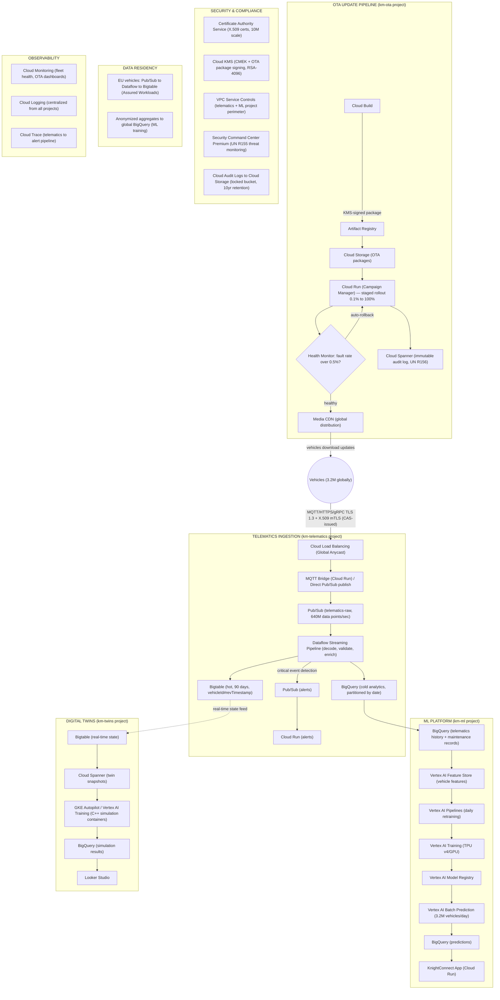

# Case Study 4: KnightMotives Automotive

> **Exam Version:** Google Professional Cloud Architect (PCA) — 2025 (Updated October 2025)
> **Domain:** Connected Vehicles / Automotive IoT | **Compliance:** UNECE WP.29 (Cybersecurity), ISO/SAE 21434, Automotive SPICE

---

## 1. Company Overview

**KnightMotives Automotive** is a global vehicle manufacturer producing passenger cars, SUVs, and light commercial vehicles. Over the past five years, KnightMotives has shifted from traditional automotive manufacturing to becoming a "mobility technology company" — embedding connectivity, software, and AI into every vehicle produced.

**Scale:**
- 3.2 million connected vehicles in operation globally (growing 800K/year)
- 15 vehicle models, spanning economy to premium segments
- Manufacturing plants in Germany, US, Mexico, and South Korea
- Operational in 45 countries
- Software engineering team: 4,000 engineers (expanded significantly in last 3 years)

**Connected vehicle platform — KnightConnect:**
- **Telematics**: GPS, speed, RPM, fuel/battery level, collision data, driver behavior
- **OTA Updates**: deliver software updates to ECUs (Electronic Control Units) and infotainment systems
- **Predictive Maintenance**: alert drivers before failures occur; schedule service proactively
- **Digital Twin**: real-time and simulation-based virtual representation of each vehicle
- **Driver Assistance**: AI features (lane assist, adaptive cruise, parking assistance) that improve over time via OTA

**Current challenges:**
- On-premises telematics platform in 3 data centers can't scale to 3.2M+ vehicles sending data every second
- OTA update system is manual and brittle — a botched update impacted 200K vehicles in 2023
- ML model training for predictive maintenance takes 2 weeks — models are stale by deployment
- Digital twin simulations run on on-prem compute cluster — insufficient capacity; jobs queue for days
- No global observability platform — each regional team has separate monitoring
- UNECE WP.29 compliance requires audit trails and cybersecurity controls that the current system lacks

**Strategic goals:**
- Migrate KnightConnect platform to GCP to scale to 10M vehicles by 2027
- Implement near-real-time telematics processing with Dataflow
- Build a robust, monitored OTA update pipeline with staged rollout and rollback
- Accelerate ML model development with Vertex AI
- Implement digital twins at scale using GCP infrastructure
- Achieve UNECE WP.29 Regulation UN R155/R156 compliance

---

## 2. Technical Requirements

1. **Telematics ingestion** at scale: ingest 200+ data points per vehicle per second from 3.2M vehicles → ~640M data points/second at peak.
2. **Near-real-time processing**: telematics events (collision, hard brake, fault code) must trigger alerts within 5 seconds of occurrence.
3. **OTA update pipeline**: staged rollout to vehicle fleets with health monitoring; automatic rollback if failure rate exceeds threshold.
4. **Predictive maintenance**: ML models that predict component failures 2–4 weeks in advance with >85% precision.
5. **Digital twins**: virtual representations of each vehicle updated in near-real time; support simulation workloads for testing.
6. **Driver assistance AI**: deploy updated AI models to vehicles via OTA; models trained on Vertex AI.
7. **Global data pipeline**: process telematics data from all 45 countries; comply with data residency requirements (EU data stays in EU).
8. **Cybersecurity**: end-to-end encryption of telematics data; zero-trust architecture; HSM-backed key management.
9. **Observability**: unified platform for vehicle health, OTA progress, and backend service health.
10. **Scalability**: architecture must support 10M vehicles by 2027 with no redesign.

---

## 3. Business Requirements

1. **Predictive maintenance revenue**: subscription service alerting owners before failures; requires high-precision ML models.
2. **OTA as competitive advantage**: faster and safer OTA delivery vs. competitors improves customer satisfaction and reduces recall costs.
3. **Regulatory compliance**: UNECE WP.29 (UN R155 cybersecurity, UN R156 software updates) is mandatory for all new vehicle type approvals in EU/UK/Japan; non-compliance = vehicles cannot be sold.
4. **Data monetization** (future): anonymized telematics data for insurance, mapping, and urban planning — architecture must support privacy-preserving analytics.
5. **Reduce recall risk**: improve OTA rollout safety to prevent mass software defects like the 2023 incident.
6. **Accelerate time-to-market for AI features**: current 2-week ML training cycle delays feature releases; target: daily retraining.
7. **Cost efficiency**: telematics data storage costs must be controlled — not all data needs to be retained at full fidelity indefinitely.
8. **Global developer platform**: engineering teams across 4 manufacturing countries need consistent tooling.

---

## 4. Existing Technical Infrastructure

### Telematics Platform (On-Premises)

| Component | Technology | Notes |
|-----------|-----------|-------|
| MQTT broker | Mosquitto (open-source) | 3 data centers, ~200K concurrent connections each |
| Message queue | Apache Kafka (on-prem) | 60 brokers, ~500K msgs/sec max |
| Stream processor | Apache Flink (on-prem) | 3 processing clusters |
| Time-series DB | InfluxDB | Vehicle telemetry storage |
| Cold storage | On-prem NAS | 2 PB of historical telemetry |
| OTA server | Custom Java + AWS S3 (vendor) | Update packages distributed via CDN |

### ML & Analytics Platform

| System | Technology | Notes |
|--------|-----------|-------|
| ML training | On-prem GPU cluster (80 x V100) | Shared across teams; 2-week model training |
| Data warehouse | Apache Hive on HDFS (300-node cluster) | 5PB, batch analytics |
| Analytics viz | Tableau (on-prem) | Connected to Hive |

### Digital Twin Platform

| System | Technology | Notes |
|--------|-----------|-------|
| Simulation engine | Custom C++ simulator | Runs on HPC cluster |
| Twin storage | PostgreSQL (central) | Vehicle state snapshots |
| Simulation jobs | Manual job submission | Jobs queue for 3–5 days |

### Networking & Security

- TLS for MQTT connections to telematics broker
- Per-vehicle TLS certificates (X.509) managed by in-house PKI
- No centralized key management — each region has separate HSM
- No unified audit logging for cybersecurity events

---

## 5. Recommended GCP Architecture

### Project Structure

```
Organization: knightmotives.com
  └── Folder: Production
  │     ├── Project: km-telematics       (Pub/Sub, Dataflow, Bigtable)
  │     ├── Project: km-ml               (Vertex AI, BigQuery)
  │     ├── Project: km-ota              (GCS, Cloud Run, GKE)
  │     ├── Project: km-twins            (Cloud Spanner, Vertex AI, GKE)
  │     └── Project: km-security         (KMS, Certificate Authority Service, SCC)
  └── Folder: Regional (data residency)
        ├── Project: km-eu               (EU telematics data — Assured Workloads)
        └── Project: km-apac             (APAC telematics data)
```

### Telematics Ingestion Architecture

```
3.2M Vehicles
  │  (MQTT over TLS 1.3, X.509 mutual auth)
  │
  ▼
Cloud Load Balancing (Global Anycast)
  │
  ├─→ MQTT Bridge (Cloud Run — custom MQTT → Pub/Sub adapter)
  │     OR
  └─→ Direct Pub/Sub publish (for vehicles using HTTP/gRPC SDK)

Pub/Sub (telematics-raw topic)
  │  (640M msgs/sec globally — Pub/Sub auto-scales)
  │
  ▼
Dataflow Streaming Pipeline
  ├── Decode + validate telemetry payloads
  ├── Enrich with vehicle metadata (VIN → model, owner, config)
  ├── Detect critical events (collision, fault codes, battery drain)
  │     └── Critical events → Pub/Sub (alerts-critical) → Cloud Run (alert service)
  │           └── Push notification to owner mobile app (<5 sec)
  │
  ├─→ Bigtable (hot telematics data — last 90 days per vehicle)
  │     Row key: {vehicle_id}#{timestamp_reverse}
  │     Columns: GPS, speed, RPM, fault_codes, battery
  │
  └─→ BigQuery (cold analytics — partitioned by date, clustered by vehicle_id)
        └── Historical analytics, ML feature engineering, reporting
```

**Scale analysis:**
- 3.2M vehicles × 200 data points/sec = 640M data points/sec
- Pub/Sub handles this natively (auto-scales to millions of messages/sec)
- Bigtable: at 640M rows/sec, scale to 100+ nodes; designed for exactly this pattern
- BigQuery: streaming inserts at this rate → use Pub/Sub → Dataflow → BigQuery (avoid direct streaming insert cost at this volume)

### OTA Update Pipeline

```
OTA Release Flow:
┌─────────────────────────────────────────────────────────────────────────┐
│  1. PACKAGING                                                            │
│  Software Build (Cloud Build) → Update Package (signed with Cloud KMS)  │
│  → Artifact Registry (OTA packages) → Cloud Storage (distribution)      │
│                                                                          │
│  2. STAGED ROLLOUT                                                       │
│  Cloud Run (OTA Campaign Manager)                                        │
│  ├── Stage 1: 0.1% of fleet (canary — engineering test vehicles)        │
│  ├── Stage 2: 1% (internal employees + beta users)                      │
│  ├── Stage 3: 10% (randomized production vehicles)                      │
│  ├── Stage 4: 50%                                                        │
│  └── Stage 5: 100%                                                       │
│                                                                          │
│  Between each stage: monitor for 24 hours                               │
│  Auto-rollback trigger: fault rate > 0.5% OR crash rate > 0.1%         │
│                                                                          │
│  3. DELIVERY                                                             │
│  Cloud Storage → Media CDN (global distribution of update packages)     │
│  Vehicles download when: connected to Wi-Fi, plugged in, not driving    │
│                                                                          │
│  4. VERIFICATION                                                         │
│  Post-update: vehicle publishes cryptographic hash to Pub/Sub           │
│  → Dataflow verifies hash against expected value                         │
│  → BigQuery records update status per vehicle (audit trail)              │
│  → Update completion dashboard: Looker Studio                           │
└─────────────────────────────────────────────────────────────────────────┘
```

**OTA Security (UNECE WP.29 / UN R156):**
- All update packages signed with Cloud KMS asymmetric key (RSA-4096)
- Vehicles verify signature before installing any update
- Campaign Manager maintains immutable audit log in Cloud Spanner (who authorized, when, what version)
- Anti-rollback counter prevents downgrade attacks

### Predictive Maintenance ML Platform

```
Telemetry + Maintenance History (BigQuery)
        │
        ▼
  Vertex AI Feature Store
  (pre-computed vehicle features: mileage, temperature patterns,
   vibration signatures, component age, historical fault codes)
        │
        ▼
  Vertex AI Pipelines (daily retraining pipeline)
  ├── Data validation (Great Expectations / TFX)
  ├── Feature engineering (Dataflow → Feature Store)
  ├── Model training (Vertex AI Training — TPU v4, gradient boosting + LSTM)
  ├── Model evaluation (precision/recall gate: must exceed 85% precision)
  ├── Model registration (Vertex AI Model Registry)
  └── Deploy to Vertex AI Endpoints (prediction API)
        │
        ▼
  KnightConnect App Backend (Cloud Run)
  └── Query prediction API per vehicle → if failure probability > threshold:
        └── Push notification to owner: "Your brake pads may need replacement"
        └── Dealer notification system (partner API)
```

**Model details:**
- Input features: 60+ engineered features per vehicle (sensor aggregates, historical patterns)
- Models: gradient boosting (XGBoost) for tabular features + LSTM for time-series vibration patterns
- Ensemble via Vertex AI custom prediction routine
- Training data: 3 years of telemetry + maintenance records across 3.2M vehicles = petabytes

### Digital Twins

```
Real-Time Vehicle State (from Bigtable)
        │
        ▼
  Cloud Spanner (digital-twin-db)
  └── One row per vehicle: current state snapshot (JSON in PROTO columns)
      ├── Location, speed, heading
      ├── All sensor readings (last 60 seconds)
      ├── Software version per ECU
      └── Component health scores (from ML)

Simulation Workloads:
  GKE Autopilot (simulation-cluster)
  └── C++ simulation containers (existing simulator, containerized)
  └── Vertex AI custom training jobs (for AI feature training via simulation)
  └── Jobs submitted via Cloud Run API (replaces manual job submission)
  └── Results stored in BigQuery (simulation results)
  └── Typical job: complete in 30 min vs. 3-5 days previously
```

### Driver Assistance AI

```
Training:
  Anonymized sensor data (camera, lidar, radar frames from fleet)
  → Cloud Storage (raw frames, petabyte-scale)
  → Dataflow (frame extraction, labeling pipeline integration)
  → Vertex AI Training (CNN + transformer models on GPU/TPU pods)
  → Vertex AI Model Registry → quantized model for ECU deployment

Deployment:
  Vertex AI Model Registry → Cloud Storage (quantized .tflite/.onnx model)
  → OTA Campaign Manager (treat AI model as OTA package)
  → Delivered to vehicles via same OTA pipeline
  → ECU runs inference on-device (no cloud dependency for ADAS)
```

### Global Data Architecture

| Region | Data | Services |
|--------|------|---------|
| Global (US) | Model training, analytics, OTA packages | BigQuery, Vertex AI, Cloud Storage |
| EU (europe-west1, europe-west4) | EU vehicle telematics (data residency) | Pub/Sub, Dataflow, Bigtable (EU project) |
| APAC (asia-northeast1) | APAC vehicle telematics | Pub/Sub, Dataflow, Bigtable (APAC project) |
| US (us-central1) | US/LATAM vehicle telematics | Pub/Sub, Dataflow, Bigtable (primary project) |

Anonymized/aggregated data flows globally for ML training; raw PII-bearing data stays in region.

### Security Architecture

| Requirement | GCP Service | Notes |
|-------------|------------|-------|
| Vehicle identity (X.509 certs) | **Certificate Authority Service** (CAS) | Managed PKI; issues and rotates per-vehicle certs |
| OTA package signing | **Cloud KMS** (asymmetric, RSA-4096) | Vehicles verify signature; private key never leaves KMS |
| Telematics encryption in transit | TLS 1.3 + mTLS (vehicle to Cloud LB) | X.509 mutual authentication |
| Data at rest | CMEK with **Cloud KMS** | Bigtable, BigQuery, Cloud Storage all use CMEK |
| Cybersecurity event logging | **Cloud Audit Logs** → Cloud Storage (locked, 10yr) | UNECE WP.29 requires audit trail of all software updates and security events |
| Threat detection | **Security Command Center Premium** | Detects anomalous API access, unusual data export |
| Secrets | **Secret Manager** | Service credentials, API keys |
| Network isolation | **VPC Service Controls** | Perimeter around telematics and ML projects |

---

## 6. Migration Strategy

### Phase 1 — Telematics Platform Migration (Months 1–6)

- Deploy Pub/Sub + Dataflow streaming pipeline in GCP alongside existing Kafka/Flink
- Shadow mode: mirror 5% of vehicle traffic to GCP pipeline; validate data completeness
- Deploy Bigtable cluster; validate query patterns match use cases
- Gradually shift vehicle traffic by region (start with APAC — lowest volume, newest vehicles with HTTP SDK support)
- Deploy Certificate Authority Service; begin issuing new vehicle certs from GCP PKI (on next service interval for existing fleet)
- Target: 100% telematics ingestion on GCP by end of Phase 1

### Phase 2 — OTA Platform Migration (Months 4–9)

- Build OTA Campaign Manager on Cloud Run
- Migrate existing update packages to Cloud Storage
- Deploy staged rollout logic with health monitoring and auto-rollback
- Pilot with 10,000 vehicles (KnightMotives employee fleet)
- Achieve UNECE WP.29 UN R156 audit trail compliance validation
- Full fleet migration to new OTA platform before next major software release

### Phase 3 — ML Platform Migration (Months 6–12)

- Migrate historical training data from Hive/HDFS to BigQuery (Storage Transfer Service + Dataflow)
- Set up Vertex AI Pipelines for predictive maintenance model; validate against on-prem model performance
- Deploy to Vertex AI Endpoints; A/B test vs. existing model
- Migrate ADAS model training to Vertex AI TPU pods
- Decommission on-prem GPU cluster (except keep 20 V100s for low-latency experiments)

### Phase 4 — Digital Twins & Analytics (Months 10–18)

- Containerize C++ simulation engine; deploy on GKE Autopilot
- Migrate PostgreSQL twin state DB to Cloud Spanner
- Migrate analytics from Hive/Tableau to BigQuery/Looker
- Decommission HDFS cluster, on-prem InfluxDB, NAS cold storage
- Launch monetization pilot: privacy-preserving telematics analytics product (differential privacy with BigQuery)

---

## 7. Security & Compliance Considerations

### UNECE WP.29 — UN R155 (Cybersecurity)

UN R155 requires a **Cybersecurity Management System (CSMS)** covering the full vehicle lifecycle. GCP supports this with:

| UN R155 Requirement | GCP Implementation |
|--------------------|-------------------|
| Threat analysis and risk assessment (TARA) | Security Command Center Premium (continuous threat assessment); Cloud Asset Inventory |
| Protect vehicles from cyberattacks | mTLS with X.509 per-vehicle certs (Certificate Authority Service); Cloud Armor on ingestion endpoints |
| Detect and respond to cyberattacks | SCC Premium threat detection; Cloud Logging + alerting pipeline; SOC integration via Pub/Sub export |
| Monitor vehicle cybersecurity events | Cloud Audit Logs → BigQuery (vehicle event analytics); real-time anomaly detection via Vertex AI |
| Secure the update mechanism | OTA package signing (Cloud KMS asymmetric); anti-rollback counter; installation audit trail |

### UNECE WP.29 — UN R156 (Software Updates)

UN R156 requires a **Software Update Management System (SUMS)**:

| UN R156 Requirement | GCP Implementation |
|--------------------|-------------------|
| Traceability of software updates | Cloud Spanner (immutable update audit log: vehicle ID, package hash, timestamp, installer version) |
| Safe update delivery | Staged rollout with health monitoring; auto-rollback on failure threshold |
| Cryptographic verification | Cloud KMS RSA-4096 signing; vehicles verify before installation |
| Update audit trail | Cloud Audit Logs + Spanner; minimum 10-year retention per regulation |
| No unauthorized updates | IAM: only OTA Campaign Manager service account can write to OTA packages bucket; Binary Authorization for container images |

### ISO/SAE 21434

- Defines cybersecurity engineering requirements for road vehicles
- Cloud KMS provides cryptographic agility (algorithm updates without hardware changes)
- Certificate Authority Service provides certificate lifecycle management across millions of vehicles
- Vulnerability Management: Artifact Registry scanning + Container Analysis for all OTA-related container images

### Data Residency

- EU regulation (GDPR + national automotive data laws): EU vehicle telemetry must stay in EU
- Assured Workloads on `km-eu` project enforces EU region constraint
- Only anonymized, aggregated data flows to global BigQuery for ML training
- **Differential privacy** applied before exporting aggregate telemetry for monetization

---

## 8. Key Design Decisions

### Decision 1: Pub/Sub + Bigtable vs. Kafka + InfluxDB

**Chose Pub/Sub + Bigtable** to replace the on-prem Kafka + InfluxDB stack.
- *Rationale*: Pub/Sub is a fully managed, serverless messaging service that auto-scales to handle billions of messages per second — no broker management, replication, or partition rebalancing. Bigtable is the industry standard for time-series IoT data at scale (it powers Google Maps, Gmail). The row key design `{vehicle_id}#{reverse_timestamp}` enables efficient per-vehicle time-range queries.
- *Trade-off*: Pub/Sub lacks Kafka's consumer group semantics and log compaction. For the telematics use case, at-least-once delivery with Dataflow's deduplication is sufficient. Advanced Kafka features are not needed here.

### Decision 2: Cloud Spanner for OTA Audit Trail

**Chose Cloud Spanner** (not BigQuery or Cloud SQL) for the OTA audit trail.
- *Rationale*: OTA audit records must be immutable, globally consistent, and queryable with transactional guarantees. Cloud Spanner provides serializable transactions, meaning no two update campaigns can conflict. With 10-year retention requirements, Spanner's scalability outperforms Cloud SQL. Unlike BigQuery, Spanner provides row-level transactional writes without streaming insert limitations.
- *Trade-off*: Higher cost than Cloud SQL. Justified by the regulatory requirement for transactional consistency in the audit trail.

### Decision 3: Certificate Authority Service vs. Custom PKI

**Chose Certificate Authority Service (CAS)**.
- *Rationale*: Managing PKI for 3.2M vehicles (growing to 10M) is complex — certificate issuance, rotation, revocation, and HSM management. CAS provides a managed, HSM-backed root CA that integrates with Secret Manager and Cloud KMS. It scales to millions of certificates and provides OCSP for revocation checking.
- *Trade-off*: Vendor dependency for PKI. Mitigated by using CAS's certificate export capability for backup roots.

### Decision 4: Staged OTA Rollout with Auto-Rollback

**Designed a 5-stage OTA rollout** with automatic rollback.
- *Rationale*: The 2023 incident (200K vehicles affected by bad update) demonstrates that "big bang" OTA deployments are too risky for safety-critical vehicle software. A 5-stage rollout with health monitoring between stages limits blast radius to 0.1% → 1% → 10% → 50% → 100%. Auto-rollback on fault rate threshold prevents human reaction time from being the bottleneck.
- *Trade-off*: Full fleet update takes longer (days vs. hours). Acceptable trade-off given the safety implications.

### Decision 5: Vertex AI Feature Store for Predictive Maintenance

**Chose Vertex AI Feature Store** for serving vehicle features to the prediction API.
- *Rationale*: The predictive maintenance API is queried for 3.2M+ vehicles continuously. Pre-computing and storing features in Feature Store enables <10ms feature retrieval for online inference. Without Feature Store, the prediction API would need to re-compute all features from raw BigQuery data on every request — prohibitively slow and expensive.
- *Trade-off*: Feature freshness is limited by the feature ingestion frequency (typically hourly for most features). For daily prediction (not real-time inference), this is fully acceptable.

---

## 9. Sample Exam Questions

---

**Question 1**

KnightMotives needs to ingest telematics data from 3.2 million connected vehicles, with each vehicle sending 200 data points per second. Critical events (collision, fault codes) must trigger alerts within 5 seconds. Which architecture handles this ingestion and alerting requirement?

- A) Apache Kafka on GKE + InfluxDB for storage
- B) Cloud Pub/Sub (telematics-raw topic) → Dataflow streaming pipeline (critical event detection) → Pub/Sub (alerts-critical topic) → Cloud Run (alert service)
- C) Cloud IoT Core → BigQuery (streaming inserts) → Cloud Functions (alert)
- D) MQTT broker on Compute Engine → Cloud SQL → Cloud Monitoring alerts

**Answer: B**

*Explanation:* **Cloud Pub/Sub** auto-scales to handle billions of messages per second with no configuration — it natively handles the 640M data points/second from 3.2M vehicles. **Dataflow** processes the stream in near-real-time, applying event detection logic (collision detection, fault code parsing) with <2-second processing latency. Critical events route to a separate Pub/Sub topic that triggers Cloud Run for sub-5-second alerting. Option A (Kafka on GKE) requires managing 60+ brokers — operational burden KnightMotives wants to eliminate. **Note**: Cloud IoT Core (C) was deprecated in August 2023 — this is a common exam distractor. Option D (MQTT on Compute Engine) is self-managed and won't scale to 3.2M vehicles.

---

**Question 2**

KnightMotives must comply with UNECE WP.29 UN R156, which requires a Software Update Management System (SUMS) with cryptographic verification and a 10-year immutable audit trail of all OTA updates. Which design satisfies these requirements?

- A) Store OTA packages in Cloud Storage; log updates to BigQuery; use Cloud KMS for package signing
- B) Store OTA packages signed with Cloud KMS (asymmetric RSA-4096) in Cloud Storage; record update events (vehicle ID, package hash, timestamp) in Cloud Spanner with retention-locked rows; Cloud Audit Logs for API-level audit
- C) Store OTA packages in Cloud Storage; use SHA-256 checksums in Cloud SQL for verification
- D) Use Binary Authorization for OTA packages; store update logs in Cloud Logging

**Answer: B**

*Explanation:* UN R156 requires cryptographic verification of update packages and immutable audit trails. **Cloud KMS asymmetric signing** (RSA-4096) provides non-repudiable package signatures — vehicles verify the signature before installation. **Cloud Spanner** with retention policies provides ACID-transactional, globally consistent audit records that satisfy the 10-year immutability requirement. **Cloud Audit Logs** captures API-level operations for compliance completeness. Option A lacks the immutability guarantee — BigQuery rows can be deleted. SHA-256 checksums in Cloud SQL (C) provide integrity checking but not signing authority (anyone can compute a hash). Binary Authorization (D) is for container deployment policy, not OTA package verification.

---

**Question 3**

KnightMotives stores 90 days of hot telematics data for per-vehicle queries (e.g., "show me vehicle X's last 7 days of telemetry"). The query pattern is: given a vehicle ID and time range, retrieve all data points. Hundreds of engineers query this data simultaneously. Which storage service and row key design is most appropriate?

- A) BigQuery — query by vehicle_id column filter
- B) Cloud Bigtable — row key: `{vehicle_id}#{reverse_timestamp}`
- C) Cloud SQL (PostgreSQL) — indexed on (vehicle_id, timestamp)
- D) Firestore — collection per vehicle, document per data point

**Answer: B — Cloud Bigtable with reverse timestamp row key**

*Explanation:* Bigtable is purpose-built for time-series IoT data with high write throughput (640M data points/sec) and low-latency reads. The row key design `{vehicle_id}#{reverse_timestamp}` enables efficient prefix scans on vehicle ID (all data for a vehicle) with the most recent data first (reverse timestamp = most recent is lexicographically first). Bigtable row key prefix scans are O(log n). BigQuery (A) is not optimized for row-level lookups — a per-vehicle range scan on 640M rows/day would be slow and expensive. Cloud SQL (C) cannot scale to 640M inserts/second. Firestore (D) has document size limits (1MB) and would require millions of documents per vehicle.

---

**Question 4**

KnightMotives' 2023 OTA incident affected 200,000 vehicles with a faulty software update. They want to implement a safer OTA rollout process. Which mechanism provides the best protection against mass-scale OTA failures?

- A) Require manual approval for every OTA update before deployment
- B) Deploy OTA updates to 100% of the fleet simultaneously but with a 24-hour monitoring window before marking as stable
- C) Implement staged rollout (0.1% → 1% → 10% → 50% → 100%) with automated health monitoring between stages; automatically rollback if fault rate exceeds 0.5%
- D) Deploy OTA updates only during maintenance windows (2–4 AM local time)

**Answer: C**

*Explanation:* A staged rollout limits the blast radius — if a bad update affects 0.1% of the fleet (3,200 vehicles), it's caught before reaching 200K. Automated health monitoring removes human reaction time from the equation; if the fault rate threshold is breached, the rollback is immediate (not dependent on a human noticing the alert and acting). This is the standard industry pattern for safe OTA in automotive (used by Tesla, Rivian, etc.). Manual approval (A) doesn't prevent mass failures — it only delays the initial deployment. Simultaneous 100% deployment (B) with monitoring doesn't reduce blast radius. Maintenance windows (D) reduce customer impact but don't prevent mass failures.

---

**Question 5**

KnightMotives is building a predictive maintenance ML platform. Their data science team wants to retrain models daily using 3 years of telemetry data in BigQuery. The model must serve predictions for 3.2M vehicles, with each vehicle's prediction requested once per day. Which Vertex AI configuration best supports this?

- A) Vertex AI Workbench (Jupyter) for daily manual model retraining; export model to Cloud Storage; serve with Cloud Run
- B) Vertex AI Pipelines for automated daily retraining → Vertex AI Model Registry → Vertex AI Batch Prediction (daily batch job for all 3.2M vehicles)
- C) BigQuery ML for model training; BigQuery scheduled query for daily predictions
- D) Vertex AI AutoML Tables → Vertex AI Endpoints (online serving, queried per vehicle on demand)

**Answer: B**

*Explanation:* **Vertex AI Pipelines** automates the daily retraining workflow (trigger → train → evaluate → register → deploy), replacing manual processes. Since predictions are needed once per day (not real-time), **Vertex AI Batch Prediction** is more cost-effective than online endpoints — it processes all 3.2M vehicles in a single batch job and writes results to BigQuery, where the application reads predictions. This avoids the cost and latency overhead of 3.2M individual API calls to an online endpoint. Manual Workbench (A) is not automated — the "daily retraining" requirement implies automation. BigQuery ML (C) supports simpler models but not the LSTM/ensemble models needed for vibration-based fault detection. AutoML Tables + online serving (D) is expensive for 3.2M vehicles queried individually and AutoML Tables may not support the model complexity needed.

---

**Question 6**

KnightMotives must store EU vehicle telematics data within the EU to comply with GDPR and national data residency requirements, while still using global BigQuery for ML training on anonymized data. Which architecture achieves this?

- A) Store all telematics data in a single global BigQuery dataset; apply row-level security by region
- B) EU telematics project (Assured Workloads, EU regions): Pub/Sub → Dataflow → Bigtable (EU); anonymize/aggregate in Dataflow → Pub/Sub → global BigQuery project for ML training
- C) Store EU data in Cloud Storage (EU multi-region bucket); sync to BigQuery (US) nightly
- D) Use VPC Service Controls to prevent EU data from leaving the EU subnet

**Answer: B**

*Explanation:* **Assured Workloads** enforces that all resources in the EU project are created in EU regions — a hard technical control, not just a policy. EU raw telemetry stays in EU Bigtable/Pub/Sub. A Dataflow pipeline **anonymizes** (removes VINs, replaces with pseudonymous IDs) and aggregates the data before publishing to a global Pub/Sub topic, which feeds the global BigQuery ML training dataset. This satisfies data residency requirements while enabling global ML. Option A (single global BigQuery dataset with row security) doesn't enforce residency — data is still physically stored in Google's globally-distributed BigQuery infrastructure. Cloud Storage sync (C) transfers EU data to US — violates residency. VPC Service Controls (D) controls API access at the project boundary but doesn't enforce physical data residency within BigQuery.

---

**Question 7**

KnightMotives wants to issue and manage X.509 certificates for 3.2 million vehicles (for mutual TLS authentication to the telematics platform), with a path to 10 million vehicles. The PKI must support certificate rotation, revocation (OCSP), and HSM-backed root CAs. Which GCP service should they use?

- A) Cloud KMS (create a key ring per vehicle)
- B) Certificate Authority Service (CAS) with a dedicated subordinate CA per vehicle model line
- C) Self-managed OpenSSL CA on Compute Engine
- D) Secret Manager (store certificates as secrets)

**Answer: B — Certificate Authority Service (CAS)**

*Explanation:* **Certificate Authority Service** is Google's managed PKI service. It provides: HSM-backed root and subordinate CAs; certificate issuance at millions-per-day scale; certificate revocation with OCSP; integration with Cloud KMS for key storage. A subordinate CA per vehicle model line provides certificate segregation for security isolation. Cloud KMS (A) manages cryptographic keys but is not a CA — it cannot issue X.509 certificates. Self-managed OpenSSL CA (C) is feasible but creates significant operational burden for 10M certificates. Secret Manager (D) stores secrets securely but does not issue or manage certificates — it has no CA functionality.

---

**Question 8**

KnightMotives' digital twin simulations currently take 3–5 days to complete on their on-premises HPC cluster. After containerizing the C++ simulation engine, they want to run simulations on GCP with faster turnaround. Which configuration achieves this?

- A) Deploy simulations to Cloud Functions (triggered by simulation requests)
- B) Deploy simulation containers on GKE Autopilot with GPU node pools; use Cloud Run to expose job submission API; store results in BigQuery
- C) Run simulations on Compute Engine n2-standard-96 instances (manual provisioning)
- D) Submit simulations as Vertex AI Training custom jobs (GPU/CPU); store results in Cloud Storage → BigQuery

**Answer: D — Vertex AI Training custom jobs**

*Explanation:* **Vertex AI Training** supports custom container jobs (BYOC — bring your own container), which can package the existing C++ simulator. Jobs run on on-demand GPU or high-CPU machines, billed per second. The job submission API is managed; no cluster management needed. Results are stored in Cloud Storage and loaded to BigQuery for analysis. This is the most appropriate managed service for batch simulation workloads. GKE Autopilot (B) could work for container-based simulation but requires maintaining a persistent cluster and managing node provisioning for burst simulation workloads — less cost-efficient than per-job Vertex AI Training. Cloud Functions (A) has a 60-minute timeout — simulations may take longer. Manual Compute Engine (C) requires manual provisioning, scaling, and deprovisioning.

---

## 10. Architecture Diagram (Text)



---

*Last updated: October 2025 | Google PCA Exam Prep*
