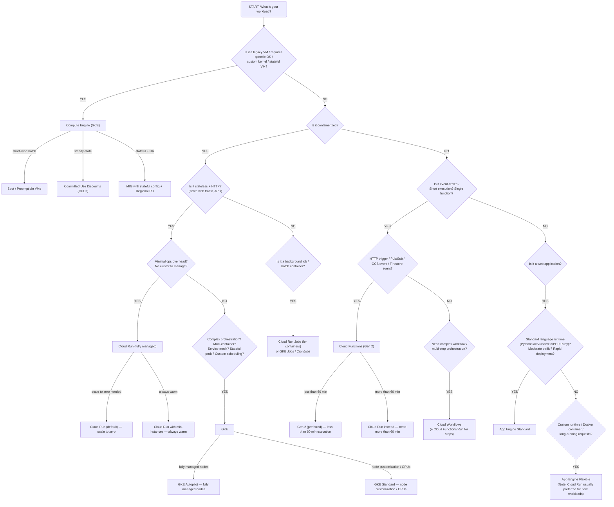
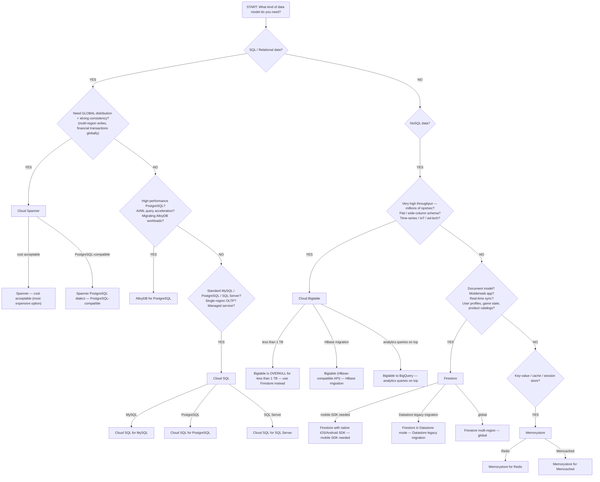
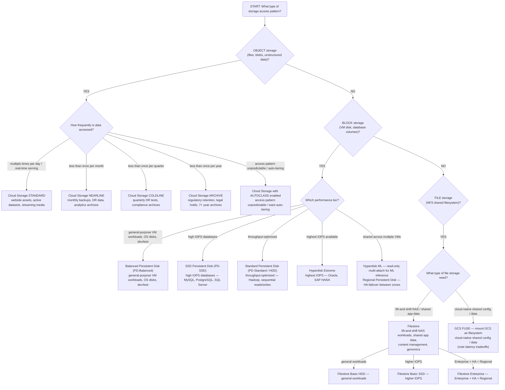
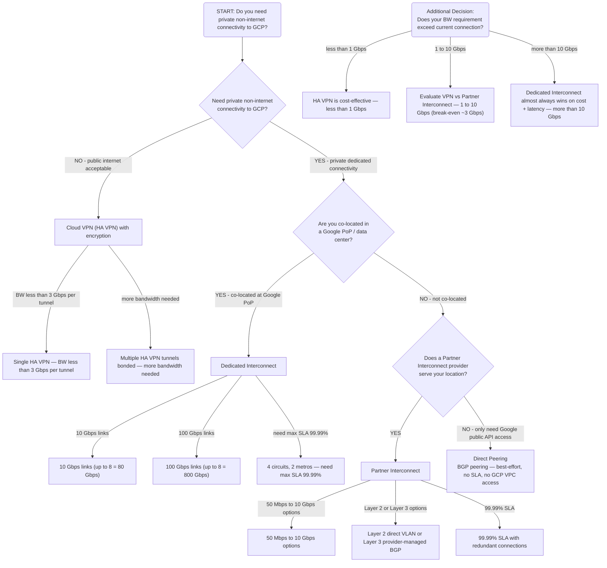
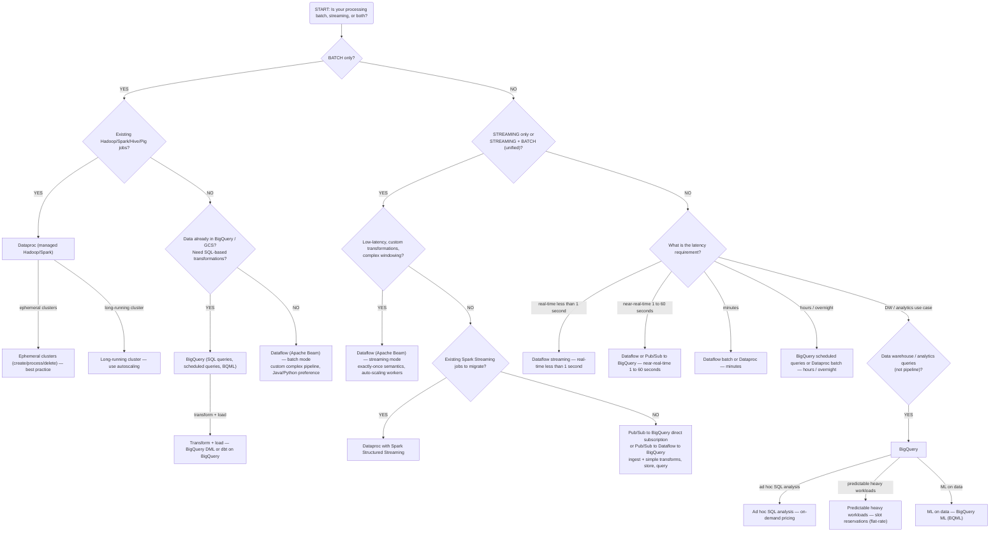
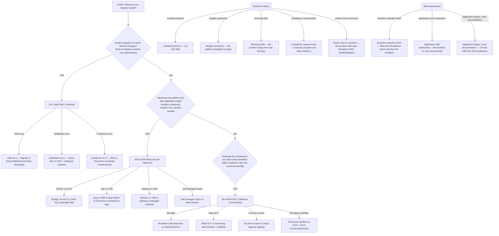
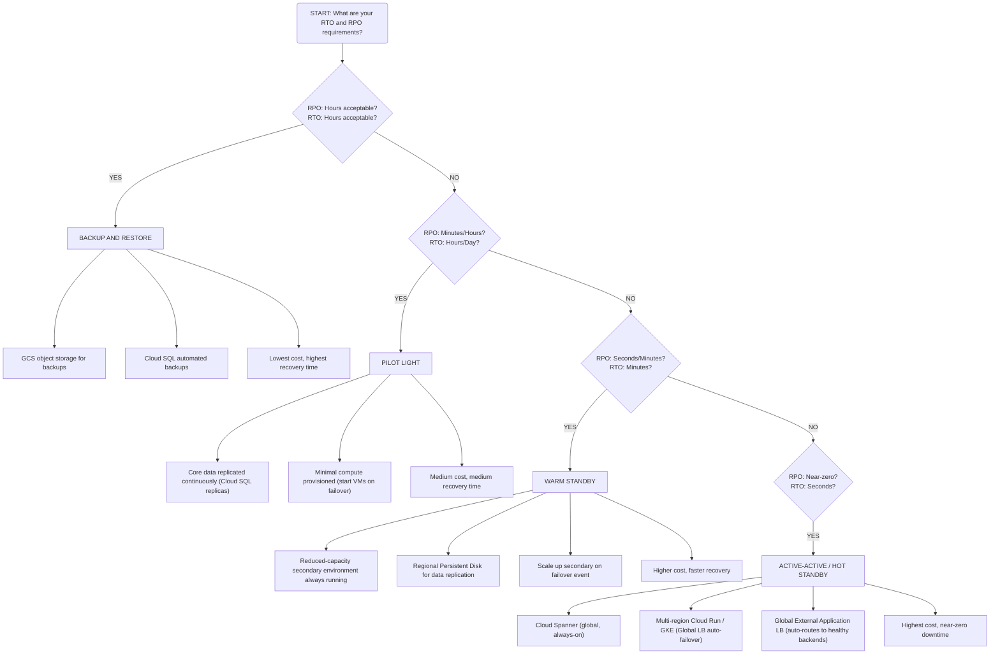

# GCP Architecture Decision Trees
> Google Professional Cloud Architect — 2025 Edition

Use these trees to rapidly eliminate wrong answers on the exam. Start at the root question and follow the branches.

---

## 1. Compute Service Selection

---

## 2. Database Service Selection

---

## 3. Storage Service Selection

---

## 4. Network Connectivity Selection (On-Premises to GCP)

---

## 5. Data Processing Service Selection

---

## 6. Migration Strategy Selection

---

## 7. Disaster Recovery Strategy Selection

