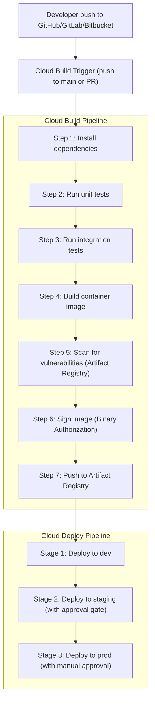

# Domain 5: Managing Implementation

> **Exam Weight: ~11%** — Expect 6–8 questions focused on CI/CD, deployment strategies, migration execution, and application integration.

---

## 5.1 Domain Overview

This domain covers the practical implementation of solutions: CI/CD pipelines, deployment strategies, migration execution, and integrating applications using GCP messaging and orchestration services.

**Key skills tested:**
- Designing and implementing CI/CD pipelines with Cloud Build and Cloud Deploy
- Selecting and implementing deployment strategies (blue/green, canary, rolling)
- Executing migration strategies with the appropriate GCP tools
- Integrating applications with Pub/Sub, Eventarc, Cloud Tasks, and Workflows
- Managing APIs with Apigee and Cloud Endpoints
- Testing strategies for cloud applications

---

## 5.2 CI/CD with Cloud Build and Cloud Deploy

### CI/CD Pipeline Architecture


### Cloud Build Deep Dive

**Key features:**
- Serverless; builds run in isolated containers
- Built-in integrations with GitHub, GitLab, Bitbucket, Cloud Source Repositories
- Supports Docker, Maven, Gradle, npm, pip, Go, etc.
- Private pool option for VPC-connected builds (access to internal resources)

**cloudbuild.yaml with substitutions:**
```yaml
substitutions:
  _REGION: us-central1
  _SERVICE: my-api
  _TAG: latest

steps:
  - id: 'unit-tests'
    name: 'node:20'
    entrypoint: 'npm'
    args: ['test']

  - id: 'build-image'
    name: 'gcr.io/cloud-builders/docker'
    args:
      - 'build'
      - '-t'
      - '${_REGION}-docker.pkg.dev/$PROJECT_ID/my-repo/${_SERVICE}:$COMMIT_SHA'
      - '.'

  - id: 'vulnerability-scan'
    name: 'gcr.io/cloud-builders/gcloud'
    args:
      - 'artifacts'
      - 'docker'
      - 'images'
      - 'scan'
      - '${_REGION}-docker.pkg.dev/$PROJECT_ID/my-repo/${_SERVICE}:$COMMIT_SHA'
      - '--format=json'

  - id: 'push-image'
    name: 'gcr.io/cloud-builders/docker'
    args:
      - 'push'
      - '${_REGION}-docker.pkg.dev/$PROJECT_ID/my-repo/${_SERVICE}:$COMMIT_SHA'

images:
  - '${_REGION}-docker.pkg.dev/$PROJECT_ID/my-repo/${_SERVICE}:$COMMIT_SHA'

options:
  logging: CLOUD_LOGGING_ONLY
  machineType: 'E2_HIGHCPU_8'
```

### Cloud Deploy Deep Dive

**Cloud Deploy** is a managed CD service for progressive delivery to GKE, Cloud Run, and GKE Enterprise (Anthos).

**Key concepts:**
- **Delivery pipeline:** Ordered sequence of targets (dev → staging → prod)
- **Target:** A deployment destination (GKE cluster, Cloud Run service, or Anthos cluster)
- **Release:** A specific version of the app + its rendering context
- **Rollout:** The process of deploying a release to a target
- **Approval gates:** Require manual human approval before promoting to a target

**clouddeploy.yaml:**
```yaml
apiVersion: deploy.cloud.google.com/v1
kind: DeliveryPipeline
metadata:
  name: my-app-pipeline
spec:
  serialPipeline:
    stages:
      - targetId: dev
        profiles: [dev]
      - targetId: staging
        profiles: [staging]
      - targetId: prod
        profiles: [prod]
        strategy:
          canary:
            runtimeConfig:
              cloudRun:
                automaticTrafficControl: true
            canaryDeployment:
              percentages: [25, 50, 75]
              verify: true
---
apiVersion: deploy.cloud.google.com/v1
kind: Target
metadata:
  name: prod
spec:
  requireApproval: true
  run:
    location: projects/my-project/locations/us-central1
```

---

## 5.3 Deployment Strategies

### Strategy Comparison
| Strategy | Description | Downtime | Risk | Rollback Speed |
|---|---|---|---|---|
| **Recreate** | Stop all, then start new | Yes | High | Slow |
| **Rolling update** | Replace instances gradually | No | Medium | Medium |
| **Blue/Green** | Switch traffic all at once between two environments | No | Low (if tested) | Instant |
| **Canary** | Gradually shift traffic to new version | No | Very Low | Instant |
| **A/B Testing** | Route specific users to different versions | No | Low | Instant |
| **Shadow** | Send duplicate traffic to new version (no user impact) | No | None | N/A |

### Blue/Green Deployment
```
Blue (current production)        Green (new version)
  └── 100% traffic                 └── 0% traffic
                                       ↑ Deploy + test
                                   ↓ Switch load balancer
  └── 0% traffic                    └── 100% traffic
  (kept for rollback)

Rollback: switch LB back to Blue
Cleanup: delete Blue after confidence period
```

**GCP Implementation:**
- **GKE:** Use two Deployments with different labels; switch Service selector
- **Cloud Run:** Use traffic splitting; `--traffic blue=0,green=100`
- **App Engine:** Use version traffic splitting
- **GCE MIGs:** Create new MIG; update load balancer backend to point to new MIG

### Canary Deployment
```
Week 1: New version gets 5% of traffic
Week 2: 25% if metrics look good
Week 3: 50%
Week 4: 100% (full rollout)

Monitor: error rate, latency, business metrics
Rollback trigger: error rate > SLO threshold
```

**Cloud Run Canary:**
```bash
# Deploy new revision
gcloud run deploy my-service \
  --image us-central1-docker.pkg.dev/project/repo/my-service:v2 \
  --no-traffic  # Don't send any traffic yet

# Send 10% to new revision
gcloud run services update-traffic my-service \
  --to-revisions my-service-v2=10,my-service-v1=90 \
  --region us-central1
```

### GKE Rolling Updates
```yaml
spec:
  strategy:
    type: RollingUpdate
    rollingUpdate:
      maxSurge: 1        # Allow 1 extra pod during update
      maxUnavailable: 0  # Never reduce below desired count
  template:
    spec:
      containers:
        - name: app
          image: us-central1-docker.pkg.dev/project/repo/app:v2
          readinessProbe:
            httpGet:
              path: /ready
              port: 8080
            initialDelaySeconds: 10
            periodSeconds: 5
```

> **Exam Tip:** `maxUnavailable: 0` ensures zero downtime during rolling updates. The trade-off is you need extra capacity (maxSurge).

---

## 5.4 Testing Strategies

### Test Types and GCP Context
| Test Type | Description | GCP Implementation |
|---|---|---|
| **Unit tests** | Test individual functions/methods | Run in Cloud Build step (any language runtime) |
| **Integration tests** | Test service interactions | Cloud Build + test environment (Cloud SQL, Pub/Sub) |
| **Contract tests** | Verify API contracts between services | Cloud Build + Pact or OpenAPI validation |
| **Load/performance tests** | Test under expected and peak load | Cloud Build trigger → GKE-based load generator (Locust, k6) |
| **Smoke tests** | Quick post-deployment sanity check | Cloud Build or Cloud Deploy `verify` step |
| **Chaos engineering** | Inject failures to test resilience | Manual or automated failure injection |

### Load Testing Architecture
```
Cloud Build trigger → Create GKE job → Run Locust/k6
    ↓
Locust workers generate traffic → Target service
    ↓
Cloud Monitoring dashboards track:
  - Request rate
  - Error rate
  - p50/p95/p99 latency
  - VM CPU/memory
    ↓
Publish results to Cloud Storage
    ↓
Cloud Build fails if thresholds exceeded
```

---

## 5.5 Cloud Run Deployment Patterns

### Cloud Run Deployment Options
| Feature | Configuration |
|---|---|
| **CPU allocation** | "CPU only during requests" (default, 0-cost when idle) OR "CPU always allocated" |
| **Min/max instances** | `--min-instances=1` (avoid cold starts), `--max-instances=100` |
| **Concurrency** | Max concurrent requests per instance (default: 80) |
| **Ingress** | All, Internal, Internal + Load Balancer |
| **VPC connector** | Route Cloud Run traffic through VPC |

### Cold Start Mitigation
- Set `--min-instances=1` to keep at least one warm instance
- Use CPU always allocated for latency-sensitive apps
- Optimize container startup time (small images, lazy initialization)
- Use Cloud Run startup CPU boost (temporary extra CPU during startup)

### Cloud Run Jobs (2025 Exam Focus)
- **Cloud Run Jobs:** Run to completion (no HTTP serving); for batch processing
- Unlike services: not triggered by HTTP; run on schedule or manually
- Support parallelism with **task indexes** for distributed processing

```bash
gcloud run jobs create data-pipeline-job \
  --image us-central1-docker.pkg.dev/project/repo/pipeline:latest \
  --tasks 10 \
  --max-retries 3 \
  --region us-central1

# Execute job
gcloud run jobs execute data-pipeline-job --region us-central1

# Schedule with Cloud Scheduler
gcloud scheduler jobs create http pipeline-daily \
  --schedule "0 2 * * *" \
  --uri "https://us-central1-run.googleapis.com/apis/run.googleapis.com/v1/namespaces/PROJECT/jobs/data-pipeline-job:run" \
  --oauth-service-account-email scheduler-sa@project.iam.gserviceaccount.com
```

---

## 5.6 Migration Strategies and Tools

### Migration Execution Path
```
Phase 1: Assess
  ├── Migration Center (inventory, sizing, TCO)
  ├── Database Migration Assessment Tool
  └── Network topology discovery

Phase 2: Plan
  ├── Select migration strategy (rehost/replatform/refactor)
  ├── Define migration waves (by dependency, risk)
  └── Design target architecture

Phase 3: Execute
  ├── Migrate test/dev workloads first
  ├── Validate functionality and performance
  ├── Migrate production with cutover window
  └── Decommission source

Phase 4: Optimize
  ├── Rightsize post-migration
  ├── Apply CUDs for stable workloads
  └── Modernize incrementally
```

### Migrate for Compute Engine
- **Source support:** VMware vSphere, Amazon EC2, Microsoft Azure, physical servers
- **How it works:**
  1. Install Migrate for Compute Engine connector in source environment
  2. Replicate VM data to Cloud Storage continuously (minimal production impact)
  3. Perform test clone (non-disruptive)
  4. During cutover window: final sync → cutover → decommission source

```bash
# Migrate using the gcloud CLI (after replication setup)
gcloud compute instances import my-migrated-vm \
  --source-vm=source-vm-name \
  --os=debian-9 \
  --zone=us-central1-a
```

### Database Migration Service (DMS)

**Supported migrations:**
| Source | Target | Migration Type |
|---|---|---|
| MySQL (on-prem, EC2, RDS) | Cloud SQL MySQL | Homogeneous |
| PostgreSQL (on-prem, EC2, RDS) | Cloud SQL PostgreSQL | Homogeneous |
| PostgreSQL | AlloyDB | Homogeneous |
| Oracle | Cloud SQL PostgreSQL | Heterogeneous |
| SQL Server | Cloud SQL SQL Server | Homogeneous |
| MySQL/PostgreSQL | Cloud Spanner | Heterogeneous |

**DMS migration modes:**
- **Continuous migration:** Ongoing replication; minimal downtime cutover
- **One-time migration:** Snapshot; requires downtime

**Connectivity options:**
- VPC peering (source and destination in same VPC)
- Reverse SSH tunnel (for on-premises sources)
- Private connectivity (via Cloud VPN/Interconnect)

### Storage Transfer Service
```
Sources:                    Destination:
  AWS S3                      Cloud Storage
  Azure Blob Storage     →
  HTTP/HTTPS URL
  On-premises (agent)
  Another GCS bucket
  POSIX filesystem
```

- Supports **scheduled transfers** (run daily, weekly)
- Can delete source files after transfer (optional)
- **Transfer agents** for on-premises source transfers

### Transfer Appliance
- Physical storage device shipped to your location
- Capacities: 40 TB and 300 TB versions
- Encrypted at rest during shipment
- Use when uploading via network would take too long (> 1 week at available bandwidth)

**Decision framework:**
```
Data size / available bandwidth > 7 days upload time?
├── YES → Transfer Appliance
└── NO  → Storage Transfer Service or gsutil

Rule of thumb:
  10 Gbps connection: 100 TB in ~1 day → use network transfer
  1 Gbps connection: 100 TB in ~10 days → use Transfer Appliance
  100 Mbps connection: 100 TB in ~100 days → definitely Transfer Appliance
```

### BigQuery Data Transfer Service
- Automated, scheduled data movement into BigQuery
- **Supported sources:**
  - Google SaaS: Google Ads, Campaign Manager, YouTube, Search Ads 360, Google Play
  - Cloud storage: Amazon S3, Azure Blob Storage, Teradata, Amazon Redshift
  - Partner connectors: Salesforce, Facebook Ads, etc.

---

## 5.7 Application Integration

### Pub/Sub (Asynchronous Messaging)

**Key characteristics:**
- At-least-once delivery (messages may be delivered more than once — design for idempotency)
- Messages retained for up to 7 days (default: 7 days; can configure retention)
- Push subscriptions: Pub/Sub pushes to HTTP endpoint
- Pull subscriptions: Consumer pulls messages on demand
- **Dead Letter Topics:** Messages that fail after max delivery attempts are forwarded here

**Pub/Sub architecture patterns:**

*Fan-out (pub/sub):*
```
Publisher → Topic → Subscription A → Cloud Run (email service)
                  → Subscription B → BigQuery (analytics)
                  → Subscription C → Dataflow (stream processing)
```

*Work queue (task distribution):*
```
API Server → Topic → Single Subscription → Multiple Pull Workers (Cloud Run / GKE)
```

**Exactly-once delivery (2025 feature):**
- Enable `exactlyOnceDelivery` on subscriptions
- Prevents duplicate message delivery
- Higher latency; use only when idempotency is not possible

### Eventarc (Event-Driven Architecture)

**What Eventarc does:**
- Routes events from GCP services, custom sources, and third-party sources to Cloud Run, GKE, and Workflows
- Uses **CloudEvents** standard format
- Decouples event producers from consumers

**Event sources:**
- GCP service events (Cloud Storage upload, BigQuery table update, Pub/Sub message)
- Audit log-based events (any GCP API call can trigger an event)
- Custom events via Eventarc channels

```bash
# Trigger Cloud Run service when a file is uploaded to Cloud Storage
gcloud eventarc triggers create process-upload-trigger \
  --location us-central1 \
  --destination-run-service file-processor \
  --destination-run-region us-central1 \
  --event-filters "type=google.cloud.storage.object.v1.finalized" \
  --event-filters "bucket=my-input-bucket" \
  --service-account eventarc-sa@project.iam.gserviceaccount.com
```

### Cloud Tasks (Async Task Queue)

**What Cloud Tasks provides:**
- Managed task queue for asynchronous HTTP requests
- Deduplication, rate limiting, retry configuration
- Tasks have explicit handlers (HTTP targets: Cloud Run, App Engine, etc.)
- Separate from Pub/Sub: tasks are **acknowledged** by the target (HTTP 200)

**Use cases:**
- Offload slow operations from web request handlers
- Rate-limited API calls to external services
- Retry failed operations with exponential backoff

```python
from google.cloud import tasks_v2
from google.protobuf import duration_pb2
import json

client = tasks_v2.CloudTasksClient()
parent = client.queue_path("project", "us-central1", "my-queue")

task = {
    "http_request": {
        "http_method": tasks_v2.HttpMethod.POST,
        "url": "https://my-service-xyz.run.app/process",
        "headers": {"Content-Type": "application/json"},
        "body": json.dumps({"order_id": "123"}).encode(),
        "oidc_token": {
            "service_account_email": "tasks-sa@project.iam.gserviceaccount.com"
        }
    }
}

client.create_task(request={"parent": parent, "task": task})
```

### Cloud Scheduler

- **Fully managed cron service** for scheduling recurring jobs
- Targets: HTTP endpoints (Cloud Run, Cloud Functions, App Engine), Pub/Sub topics, App Engine queues
- Timezone support, retry configuration, and pause/resume

```bash
# Run a Cloud Run job every day at 3 AM UTC
gcloud scheduler jobs create http daily-report \
  --schedule "0 3 * * *" \
  --time-zone "UTC" \
  --uri "https://us-central1-run.googleapis.com/apis/run.googleapis.com/v1/namespaces/PROJECT/jobs/generate-report:run" \
  --message-body '{}' \
  --oauth-service-account-email scheduler-sa@project.iam.gserviceaccount.com
```

### Workflows (Orchestration)

- **Serverless workflow orchestration** for connecting GCP services and external APIs
- Supports: conditional logic, retry, parallel steps, error handling, sub-workflows
- Use when coordinating multiple services in a specific order

```yaml
# Example: Order processing workflow
main:
  steps:
    - validate_order:
        call: http.post
        args:
          url: https://validation-service.run.app/validate
          body: ${order}
        result: validation_result

    - check_validation:
        switch:
          - condition: ${validation_result.body.valid == true}
            next: charge_payment

    - validation_failed:
        raise: "Order validation failed"

    - charge_payment:
        call: http.post
        args:
          url: https://payment-service.run.app/charge
          body:
            order_id: ${order.id}
            amount: ${order.total}
        result: payment_result

    - fulfill_order:
        call: http.post
        args:
          url: https://fulfillment-service.run.app/fulfill
          body: ${order}
```

### Choosing the Right Integration Service
| Service | Use Case | Key Feature |
|---|---|---|
| **Pub/Sub** | Async messaging, fan-out, event streaming | High throughput, at-least-once |
| **Eventarc** | Respond to GCP events | Event routing, CloudEvents standard |
| **Cloud Tasks** | Async task dispatch with HTTP targets | Rate limiting, deduplication, retry |
| **Cloud Scheduler** | Recurring scheduled jobs | Cron syntax, managed scheduling |
| **Workflows** | Multi-step service orchestration | Stateful, conditionals, error handling |

---

## 5.8 API Management

### Apigee

**What Apigee provides:**
- **Enterprise API management platform** (full lifecycle: design, secure, publish, analyze, monetize)
- API gateway with policy enforcement (auth, rate limiting, transformation, caching)
- Developer portal for API documentation and key management
- Analytics on API usage patterns
- Available as **Apigee X** (GCP-native) or **Apigee hybrid** (partial on-premises)

**Apigee policy types:**
| Category | Examples |
|---|---|
| **Security** | OAuth 2.0, API key validation, HMAC verification, JWT verification |
| **Traffic management** | Quota, spike arrest (rate limiting), concurrent rate limit |
| **Mediation** | Message transformation (XML↔JSON), header manipulation |
| **Extension** | Call GCP services (Firestore, BigQuery, Pub/Sub) from policies |

**When to use Apigee:**
- External API gateway for third-party developers
- Complex API transformations
- API monetization
- Developer portal with documentation

### Cloud Endpoints
- Simpler, lighter API gateway built on Nginx or ESP (Extensible Service Proxy)
- Integrates with GKE, Cloud Run, App Engine, Compute Engine
- Features: authentication (API keys, Firebase Auth, Google Auth), monitoring, logging
- Two modes:
  - **OpenAPI Endpoints:** REST APIs with OpenAPI 2.0 spec
  - **gRPC Endpoints:** Protobuf-based APIs

**When to use Cloud Endpoints vs Apigee:**
| Feature | Cloud Endpoints | Apigee X |
|---|---|---|
| Cost | Free (pay for backend compute) | Paid (per API call) |
| Complexity | Low | High |
| Features | Basic auth, monitoring | Full lifecycle management |
| Developer portal | No | Yes |
| Use case | Internal APIs, microservices | External APIs, enterprise API programs |

---

## 5.9 Artifact Registry

### Repository Types
| Format | Use Case |
|---|---|
| **Docker** | Container images |
| **Maven** | Java packages |
| **npm** | JavaScript packages |
| **Python (PyPI)** | Python packages |
| **Apt/Yum** | Linux packages |
| **Go** | Go modules |
| **Generic** | Arbitrary files |

### Remote and Virtual Repositories (2025)
- **Remote repositories:** Proxy and cache from upstream (Docker Hub, npm, PyPI, Maven Central)
  - Prevent repeated downloads; reduce external network costs
  - Cache approved versions (security benefit)
- **Virtual repositories:** Aggregate multiple repositories behind a single endpoint

### Integration with Cloud Build
```yaml
# In cloudbuild.yaml — use Artifact Registry as the source of truth
steps:
  - name: 'us-central1-docker.pkg.dev/$PROJECT_ID/my-repo/build-env:latest'
    entrypoint: 'npm'
    args: ['install']
```

---

## 5.10 Common Exam Question Patterns and Traps

### Pattern 1: Zero Downtime Deployment
**Q:** "Deploy a new version of a Cloud Run service with zero downtime and immediate rollback capability..."
**A:** Deploy with `--no-traffic`; test new revision; use traffic splitting for gradual canary; keep old revision for rollback

### Pattern 2: Event-Driven Processing
**Q:** "Process files uploaded to Cloud Storage asynchronously, with retry on failure..."
**A:** Eventarc trigger → Cloud Run (or Cloud Functions); Pub/Sub dead-letter topic for failed events

### Pattern 3: Migration with Minimal Downtime
**Q:** "Migrate a large MySQL database to Cloud SQL with under 5 minutes of downtime..."
**A:** Database Migration Service (DMS) with continuous replication; cutover during a maintenance window

### Pattern 4: API Rate Limiting
**Q:** "Protect a backend API from traffic spikes and enforce per-developer rate limits..."
**A:** Apigee with Spike Arrest and Quota policies

### Common Traps
- **Pub/Sub is at-least-once:** Design consumers for idempotency; use exactly-once delivery only if needed
- **Cloud Tasks ≠ Pub/Sub:** Tasks are for job dispatch with HTTP handlers; Pub/Sub is for event messaging
- **Cloud Scheduler ≠ Workflows:** Scheduler is for recurring triggers; Workflows is for orchestrating multi-step processes
- **Cloud Run min-instances:** Without setting min-instances=1, Cloud Run scales to 0 causing cold starts
- **Blue/Green rollback:** Instant rollback requires keeping both environments live — costs double until cleanup
- **DMS continuous mode:** Requires binary logging on MySQL or WAL on PostgreSQL source

---

## 5.11 Summary Table

| Topic | Key Concept | Exam Signal Words |
|---|---|---|
| CI/CD | Cloud Build (CI) + Cloud Deploy (CD) | "pipeline", "build", "deploy", "promote" |
| Blue/Green | Two environments, instant traffic switch | "zero downtime", "instant rollback", "parallel env" |
| Canary | Gradual traffic shift | "gradual rollout", "percentage", "progressive" |
| Rolling update | Replace instances gradually | "rolling", "maxSurge", "maxUnavailable" |
| VM migration | Migrate for Compute Engine | "lift-and-shift", "VMware", "AWS VMs" |
| DB migration | Database Migration Service | "MySQL", "PostgreSQL", "continuous replication" |
| Large data transfer | Transfer Appliance | "> 10 TB", "offline", "physical" |
| Pub/Sub | Async messaging, at-least-once | "decouple", "fan-out", "event streaming" |
| Eventarc | Route GCP events to handlers | "respond to GCS upload", "CloudEvents" |
| Cloud Tasks | Async HTTP task dispatch | "rate limit", "retry", "async job" |
| Workflows | Multi-step orchestration | "coordinate services", "stateful", "step function" |
| Apigee | Enterprise API management | "developer portal", "API monetization", "external API" |
| Cloud Endpoints | Lightweight API gateway | "internal API", "gRPC", "simple auth" |
| Artifact Registry | Container and package registry | "store images", "vulnerability scan", "npm/Maven" |
| Cloud Scheduler | Cron-based scheduling | "recurring job", "daily", "cron" |
